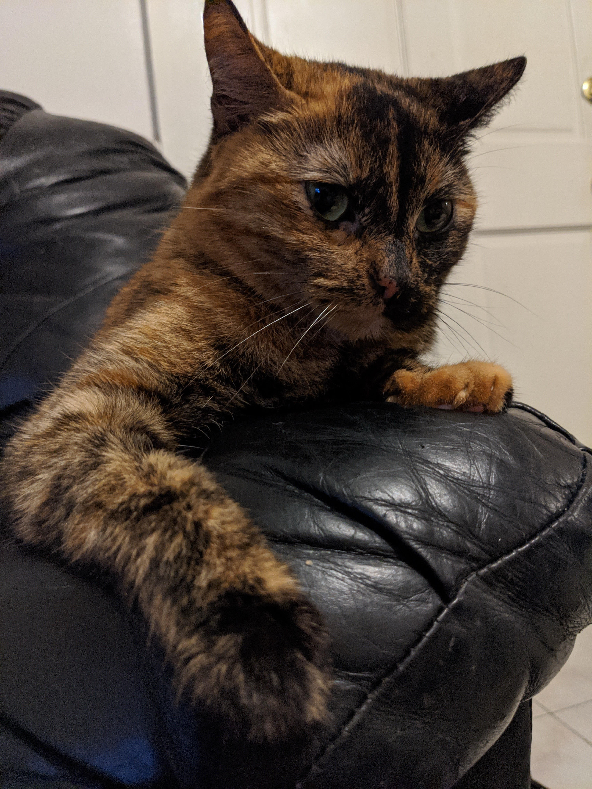
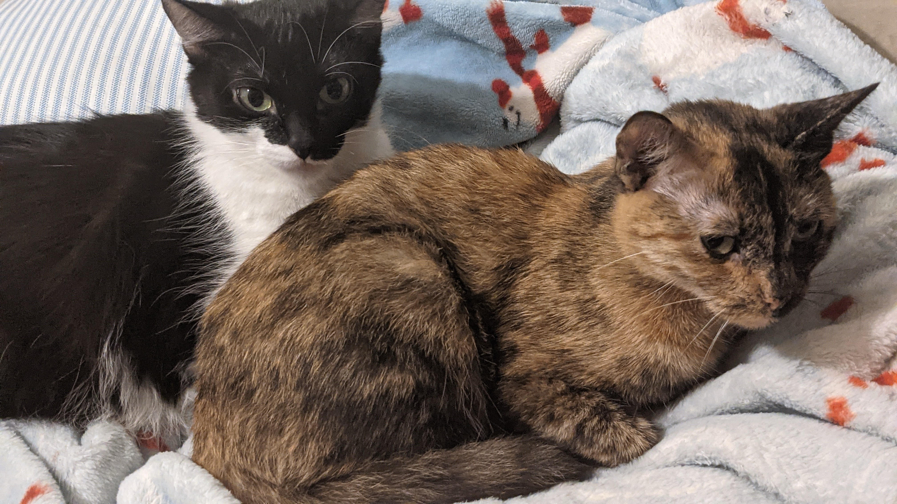

# Michael Pena's CSE110 Lab1
## Who Am I?
I am a 20 year old guy who is just trying to get about life! **Hopefully** things will go according to my plan! 

~~may or may not have a plan~~

### Likes
- programming (duh)
- frogs
- cats
- Mexican Cuisine (heuvos rancheros)
- coffee ice cream
- the color purple
- Pokemon
- rain
- lava lamps
- for-loops are pretty cool

### Top 3 Programming Feats
1. Fully made the code of one of my PAs first try the day it was due. _For legal reasons, I must make clear I won't be doing this again_
2. Optimized and played around wih the code of a hurricane simulator. (WIP)
3. Created my own mini Java code project that allows one to create a type chart as seen in Pokemon. Made the standard version, and allowed for the creation of new, unique types.

## Oops... Dropped My To-Do List
- [x] this assignment
- [ ] read more books perhaps
- [ ] make more cs friends!
- [ ] own a frog
- [x] make an epic playlist. [If your interested...](https://spotify.link/JjB4hhSKAIb)

## Cool Quotes

> A good programmer is someone who always looks both ways before crossing a one-way street

> Don't be a fish; be a frog. Swim in the water and jump when you hit ground.

> Cats choose us; we don't own them.

```
def tell_a_joke():
    setup = "Why do Java developers wear glasses?"
    punchline = "Because they don't C#."
    print(f"{setup}\n{punchline}")

tell_a_joke()
```
## Cat Pics



## Table of Contents
- [Michael Pena's CSE110 Lab1](#michael-penas-cse110-lab1)
  - [Who Am I?](#who-am-i)
    - [Likes](#likes)
    - [Top 3 Programming Feats](#top-3-programming-feats)
  - [Oops... Dropped My To-Do List](#oops-dropped-my-to-do-list)
  - [Cool Quotes](#cool-quotes)
  - [Cat Pics](#cat-pics)
  - [Table of Contents](#table-of-contents)
